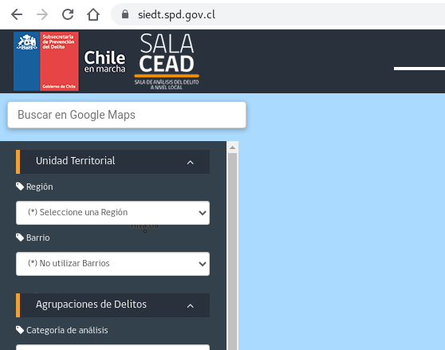
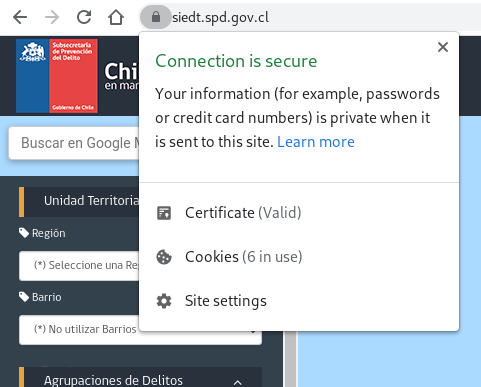
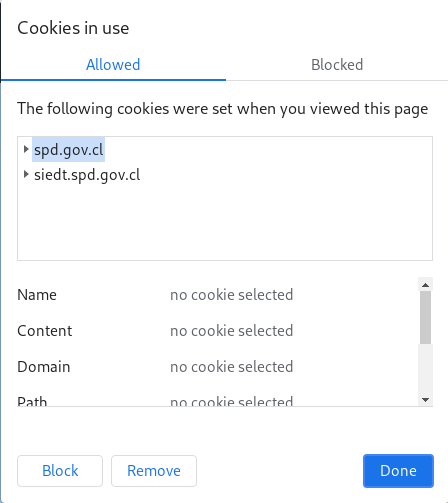
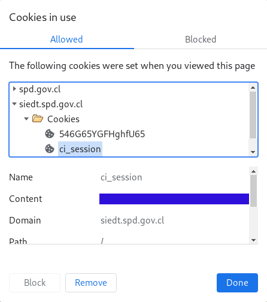

# Scraping Delitos

Este código permite datos con los delitos geolocalizados (GPKG). La solicitud se hace por región y por año. Además se descargan varios archivos, entre ellos resumenes estadisticos de la frecuencia de los delitos por categoría, fecha.
## Inicio de sesión

Los datos tienen acceso restringido. Para hacer uso de este código hay que iniciar sesión en la página [https://siedt.spd.gov.cl/](https://siedt.spd.gov.cl/). Luego de esto hay que seguír los siguientes pasos para obtener el `id` de la sesión.

1. Hacemos click en el candado al lado de la dirección URL.

2. Seleccionamos "Cookies"

3. Nos ubicamos en `siedt.spd.gov.cl` > `Cookies` > `ci_session`

4. El valor en `Content` es nuestro identificador.

## Código de ejemplo.
El código `main.R` muestra un ejemplo del uso de la función `delitosReg`. Los parámetros de esta son el número de la región, el año y el identificador.

